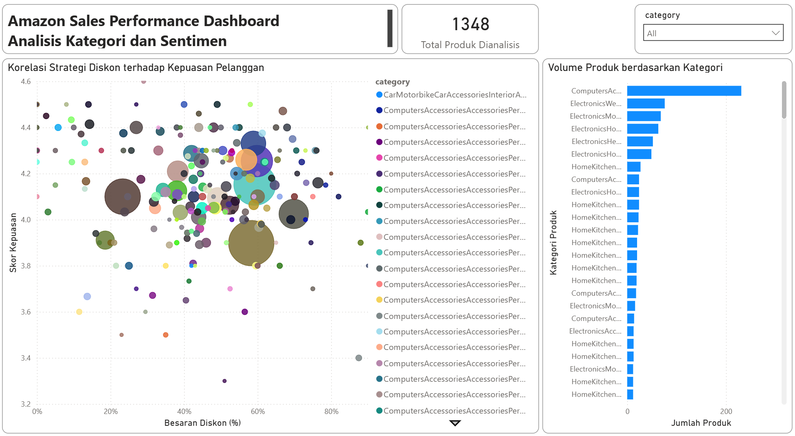

# Amazon Sales Performance Analysis (End-to-End BI Pipeline)

## Deskripsi Proyek
Proyek ini melakukan analisis mendalam terhadap lebih dari 1.300 SKU produk Amazon untuk mengidentifikasi korelasi antara strategi penetapan harga (diskon) dengan tingkat kepuasan pelanggan (rating). Sistem dibangun menggunakan arsitektur data terintegrasi yang menghubungkan proses sanitasi data, manajemen database relasional, hingga visualisasi interaktif.

## Struktur Repositori
Repositori ini disusun secara modular untuk memisahkan logika pemrosesan, penyimpanan, dan visualisasi:
* **data/**: Berisi dataset hasil sanitasi (amazon_cleaned.csv).
* **sql_scripts/**: Berisi naskah query analisis dan database dump (amazon_analysis_full_dump.sql).
* **dashboard/**: Berisi file master Power BI (amazon_sales_dashboard.pbix).
* **docs/**: Berisi aset dokumentasi dan gambar dashboard.
* **README.md**: Dokumentasi utama proyek.

## Alur Kerja Teknis

### Fase 1: Pra-pemrosesan dan Sanitasi Data
* **Sanitasi Numerik**: Penanganan konflik locale (Regional US vs ID) untuk menjaga integritas angka desimal pada harga dan rating.
* **Validasi Tipe Data**: Memastikan seluruh data numerik tervalidasi sebagai nilai (value) untuk menghindari kegagalan kalkulasi.
* **Pembersihan Teks**: Implementasi M-Code Whitelist di Power Query untuk menghapus karakter non-standar secara masif guna menjaga keamanan encoding database.

### Fase 2 & 3: Arsitektur Database dan Analisis SQL
* **Desain Skema**: Data dikelola dalam schema `amazon_analysis` dengan tabel `sales_data` menggunakan tipe data Double untuk presisi harga dan rating.
* **Analisis SQL**: Penggunaan agregasi tingkat lanjut dan logika CASE untuk segmentasi produk secara otomatis berdasarkan performa (Elite, Good, Average, Poor).
* **Identifikasi Risiko**: Deteksi "Discount Trap" pada produk dengan diskon tinggi (>50%) namun memiliki rating rendah (<3.5).

### Fase 4: Visualisasi Data Interaktif
* **Konektivitas**: Implementasi Live Connection antara MySQL dan Power BI untuk sinkronisasi data secara real-time.
* **Analisis Visual**: Pengembangan Scatter Chart untuk memetakan korelasi diskon terhadap sentimen pelanggan dan Bar Chart untuk distribusi volume produk per kategori.

## Temuan Utama
* **Dominasi Volume**: Kategori Accessories & Cables mencatat volume produk tertinggi (231 SKU).
* **Kepuasan Tertinggi**: Kategori Tablets mencapai rata-rata rating tertinggi sebesar 4.6.
* **Efisiensi Diskon**: Strategi diskon besar tidak selalu berkorelasi positif dengan rating, menunjukkan adanya variabel kualitas produk yang lebih dominan pada segmen tertentu.

## Cara Replikasi Proyek
1. Impor file `sql_scripts/amazon_analysis_full_dump.sql` ke MySQL Server.
2. Buka file `dashboard/Amazon_Sales_Analysis_Dashboard_v1.0_PROD.pbix`.
3. Sesuaikan Data Source Settings untuk menghubungkan Power BI dengan database lokal Anda.

---
**Analis**: Mohamad Rizki Septiyanto 
**Status**: Selesai 7 April 2026
